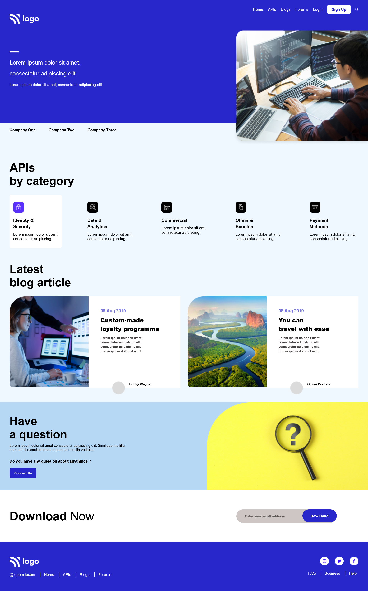

# Developer Landing Page

## Table of contents

  - [Overview](#overview)
    - [The challenge](#the-challenge)
    - [Screenshot](#screenshot)
  - [My process](#my-process)
    - [Built with](#built-with)
    - [What I learned](#what-i-learned)
    - [Continued development](#continued-development)
    - [Useful resources](#useful-resources)
  - [Author](#author)

## Overview

### The challenge

- Make a Landing page for Developers .

### Screenshot

## My process

### Built with

- Semantic HTML5 markup
- CSS custom properties like position , flexbox etc.
- Flexbox

### What I learned

- Learn how to use css position.
- Learn how to make cards for different sections.
- Learn how to use icons.

### Continued development

- With the css custom properties.

### Useful resources

- [Stackoverflow](https://stackoverflow.com/) - This is a free platform where you find the solution of your problem or an idea related to your problem.

## Author

- Kapil Kharera
- Linkedin - [@kapil-kharera](https://www.linkedin.com/in/kapil-kharera-191b83245/)

